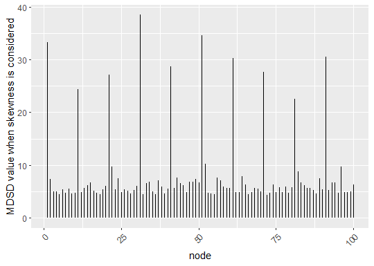

# MDSD (The Mean Degree Squared Difference)

## Description

The R package `MDSD` can be used to identify hubs using solution path information. The method is tested and compatible with `glasso`, `hglasso`, and `space` R packages. See the example below.

For more details on the MDSD distance, please refer to: (link comming soon...) Supplementary data and code needed to reproduce the results reported in the article are available at: [https://github.com/markkukuismin/MDSD_supplementary](https://github.com/markkukuismin/MDSD_supplementary).

## Dependencies

Please make sure to install the following packages before using R package `MDSD`. R with version later than 4.3.1 is needed.
```r
install.packages(c("igraph", "ggplot2", "huge"))
```

## Installation

The R package `MDSD` can be installed from source files in the GitHub repository (R package `devtools` is needed):
```r
library(devtools)
install_github(repo="markkukuismin/MDSD")
```

## Main functions

* `hub_detection_mdsd`: Compute the MDSD distance from the solution path information.
* `hub_detection_plot`: Plots of the node degree with respect to the tuning parameter value or the MDSD values.
* `cor_screening`: Thresholding of the absolute values of correlation coefficients (aka. lossy screening). One can also use the function `huge` from the `huge` package [(link)](https://cran.r-project.org/web/packages/huge/index.html). I faced with some memory leak issues while using `huge` so I made this.

## Example 1

The data should be a matrix where variables (e.g., genes) are on columns and observations on rows.

Here simulated data are generated with 100 variables and 120 observations using the procedure of the `huge` R package,
```r
library(huge)
library(ggplot2)

p <- 100
n <- 120

set.seed(1)

true_nmb_hubs <- 10

Data <- huge::huge.generator(n = n, 
                             d = p, 
                             graph = "hub",
                             g = true_nmb_hubs)
                             
dim(Data$data)
```
```
[1] 120 100
```
The following is used to compare the true hub nodes with the hub nodes detected using MDSD and can be ignored when working with real data,
```r
A_true <- Data$theta

A_true <- as.matrix(A_true)

true_hubs <- colSums(A_true)

true_hubs <- order(-true_hubs)[1:true_nmb_hubs]
```

Function `hub_detection_mdsd` can be used with with any graphical model estimator. The input parameter `sol_path` should be a list with the following elements:

* `wi`: an array of dimension `(p, p, nlambda)`
* `rholist`: vector of tuning parameter values

Here the graphical lasso estimator is used,
```r
nlambda <- 50

glasso_est <- huge(Data$data, 
                   method = "glasso",
                   nlambda = nlambda,
                   scr = TRUE)
```

One can use the following example code to make a solution path list compatible with the function `hub_detection_mdsd`,

```r
wi <- array(0, c(p, p, nlambda))

for(i in 1:nlambda){
  
  wi[,, i] <- glasso_est$path[[i]]
  
}

sol_path <- list(wi = wi, rholist = glasso_est$lambda)
```

Now the list `sol_path` can be used as an input for the function `hub_detection_mdsd`.

In this following example, we set the threshold parameter `gamma` as 3 and disregard estimated graphical models with degree distribution skewness less than 0.5,
```r
gamma = 3
skew_thr = 0.5

mdsd_res <- hub_detection_mdsd(sol_path = sol_path,
                               gamma = gamma,
                               skew_thr = skew_thr)

names(mdsd_res)
```

The true hub nodes of this example are
```r
true_hubs
```

```
[1]  1 11 21 31 41 51 61 71 81 91
```

Names of the hub nodes detected using MDSD are stored in object `hub_nodes_MDSD`. 
```r
mdsd_res$hub_nodes_MDSD
```

```
integer(0)
```

Notice that no hub nodes are detected.

The object `hub_nodes_MDSD_burn` contains names of potential hub nodes when graphical models with degree distribution skewness less than 0.5 are ignored,
```r
mdsd_res$hub_nodes_MDSD_burn
```

```
[1]  1 21 31 41 51 61 71 91
```

In this simulation example eight hub nodes out of 10 are found, 
```r
mean(true_hubs %in% mdsd_res$hub_nodes_MDSD_burn)
```
```
[1] 0.8
```

The function `hub_detection_plot` provides a graphical interpretation of the MDSD values and potential hub nodes.

One should store the output of the function to an object, here in `D`,
```r
D <- hub_detection_plot(data = mdsd_res)
```

The degree solution path can give some insight about the hub nodes,
```r
D$degree_plot
```


The graphical information of MDSD barplots is usually easier to interpret 
```r
D$MDSD_plot
```


```r
D$MDSD_burn_plot
```


From the plot `D$MDSD_burn_plot` one can see how the MDSD values of the true hub nodes stand out quite clearly.

Add a horizontal line to the plot to illustrate the cut-off value `3MDSD_p`.
```r
MDSD_data = D$mdsd_data

thr = MDSD_data$MDSD_burn

thr = gamma*mean(thr)

D$MDSD_burn_plot + 
  geom_hline(yintercept = thr, linetype = "dashed")
```


## Example 2
